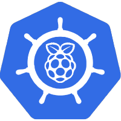

<!-- markdownlint-disable first-line-heading line-length -->

<!-- markdownlint-disable no-trailing-punctuation -->
### My home Kubernetes cluster :sailboat:

<!-- markdownlint-disable no-trailing-punctuation -->
_... managed by Flux and serviced with RenovateBot_ :robot:

 
 
 

[![task](https://img.shields.io/badge/Task-Enabled-brightgreen?style=for-the-badge&logo=data:image/png;base64,iVBORw0KGgoAAAANSUhEUgAAAEAAAABACAYAAACqaXHeAAAEeElEQVR4Xu2bzU8TQRjGZ7atRQKaGAVRhBakNbYkGEPVE5IoJh403rxIgpgYwOBHPBgPxoTwDyiCelIx8SwqxhilEj9ihBCDhK8g0IIiEAqlgLi1YxZdU2DpzszOfhy2174z7/P+5nlntrtbCHT83BzqQRyAH6sc7v16yYB6JO6aCXX4Q+MFy3InR1Or0jwRrfVoCgAhZKkf7osmKrLK4dZUk2bJ7gT6UTQWw1pgCGCg0uHKxgpWGKQ6gM6Z0IPW0PgpGp1auEFVALeGehFN4SvHqAlCFQB3RwYQH03Y6sRcOABeVTjch4gHygxgCiD4c+5o09jIM9Yi4+fbPfjNVlxczIwuMwCs7I4Lj1VbKAbQOPqVD/O8FVc4yzgIwcPKbDfVBivqoAaAEDpYP9zXwrIg2rmUuIEKgNZ2xwEDOQ5UZuUR10M04PnUD/Q1PI2jR7eYJA6WlWe57uEKwAIwiFBS83DfAu6kRojDbQtZAEa0OwlgORBrAngyFmwL/JzfS5LMqLGpVq60NDOvUUqfJIDL3e3IuT7FqPVQ6ZqN8uDKTu+qeiUB7GxpWrqGv+h0UyUz2qAvs3837ob8fWQAhEEchOC8w2W0mrD0dM1Og/hfY1QAxEynM3PARpsNK7HeQYuxGOifC6+SoQiAOJvR20K0u9QiMAEgTJzEcaAiO0/vhV6WvzsyA36jxLcfmAEQM5/NygXJFl1+B/0vPopioCey2u6qOmDl5Hq1RSK7awpASLbBagPlO3I0aYveSBjwCO8Ga7wg5i0gVe0FpxvIXl8rwES66poDEBIKW9ElxhdRSgoXIWjigHjiuckp4Fj6dgXrDUBgYQ6Eo7yiOXQDICa+4HABCMkaQ3CRcCXH8qO5A2hPCxZ21/wUwF0pT0oqKNmyTTJ8ZGEOTDOyu2EBiMIuOXcB9O+nitAcnYztbngAgsAYQqBky1ZVj01djkHcdhDiDm9OJwlXFKv7Jiil3gRgOsBsAUV9TTLY3ANoboqSEKaJNTdBcxM0N0GazqEaY26C5iZI8WiMymsEg8xTwDwFDHgKCA4+0daKtLhJoUULWCBsqvP6jkt1puydSvFdAYK2JgpVFQCEoMHrS1ijLAChmgl+oejA25d+osowg9UCkD45b7uO8UotFgCxFs+bp0h49s7ywxqADXKDN7yF2M/oiACIhbNsC5YApK705BaLCoAw6f1A/9Wage5auQRy37MAcM7rTPXANKr/G1EDEAsrePcCRX4tytW55vdKAFgg/F7n9Uk/ZMBUpBiA0ragBUBjd6pjEBPkUljz+Oij6q72kyRjSAFsAjCrNt8XJMmRKJaZA+KTOF4/RlbMh6G4ACx2O6hzFTDXy3zCeBA4pwUOAFZ2V70FpBKc+fzB75+aKFrLhokAbLavK6tx7cF+9Z2mLVR1AI4bpABACGP1Xp+FpiDSMZoBEIS9R8H1pf6O+XiRKwGoaXddWkAqaXXnJ7558vvSC4YigAy7veKaq+A26QoqjdfUASvF5rY0oSNpGaDeU6ibjj9v/5xQDsUWRgAAAABJRU5ErkJggg==)](https://taskfile.dev/#/)
[![renovate](https://img.shields.io/badge/renovate-enabled-green?style=for-the-badge&logo=data:image/svg+xml;base64,PHN2ZyB4bWxucz0iaHR0cDovL3d3dy53My5vcmcvMjAwMC9zdmciIHZpZXdCb3g9IjUgNSAzNzAgMzcwIj48Y2lyY2xlIGN4PSIxODkiIGN5PSIxOTAiIHI9IjE4NCIgZmlsbD0iI2ZlMiIvPjxwYXRoIGZpbGw9IiM4YmIiIGQ9Ik0yNTEgMjU2bC0zOC0zOGExNyAxNyAwIDAxMC0yNGw1Ni01NmMyLTIgMi02IDAtN2wtMjAtMjFhNSA1IDAgMDAtNyAwbC0xMyAxMi05LTggMTMtMTNhMTcgMTcgMCAwMTI0IDBsMjEgMjFjNyA3IDcgMTcgMCAyNGwtNTYgNTdhNSA1IDAgMDAwIDdsMzggMzh6Ii8+PHBhdGggZmlsbD0iI2Q1MSIgZD0iTTMwMCAyODhsLTggOGMtNCA0LTExIDQtMTYgMGwtNDYtNDZjLTUtNS01LTEyIDAtMTZsOC04YzQtNCAxMS00IDE1IDBsNDcgNDdjNCA0IDQgMTEgMCAxNXoiLz48cGF0aCBmaWxsPSIjYjMwIiBkPSJNMjg1IDI1OGw3IDdjNCA0IDQgMTEgMCAxNWwtOCA4Yy00IDQtMTEgNC0xNiAwbC02LTdjNCA1IDExIDUgMTUgMGw4LTdjNC01IDQtMTIgMC0xNnoiLz48cGF0aCBmaWxsPSIjYTMwIiBkPSJNMjkxIDI2NGw4IDhjNCA0IDQgMTEgMCAxNmwtOCA3Yy00IDUtMTEgNS0xNSAwbC05LThjNSA1IDEyIDUgMTYgMGw4LThjNC00IDQtMTEgMC0xNXoiLz48cGF0aCBmaWxsPSIjZTYyIiBkPSJNMjYwIDIzM2wtNC00Yy02LTYtMTctNi0yMyAwLTcgNy03IDE3IDAgMjRsNCA0Yy00LTUtNC0xMSAwLTE2bDgtOGM0LTQgMTEtNCAxNSAweiIvPjxwYXRoIGZpbGw9IiNiNDAiIGQ9Ik0yODQgMzA0Yy00IDAtOC0xLTExLTRsLTQ3LTQ3Yy02LTYtNi0xNiAwLTIybDgtOGM2LTYgMTYtNiAyMiAwbDQ3IDQ2YzYgNyA2IDE3IDAgMjNsLTggOGMtMyAzLTcgNC0xMSA0em0tMzktNzZjLTEgMC0zIDAtNCAybC04IDdjLTIgMy0yIDcgMCA5bDQ3IDQ3YTYgNiAwIDAwOSAwbDctOGMzLTIgMy02IDAtOWwtNDYtNDZjLTItMi0zLTItNS0yeiIvPjxwYXRoIGZpbGw9IiMxY2MiIGQ9Ik0xNTIgMTEzbDE4LTE4IDE4IDE4LTE4IDE4em0xLTM1bDE4LTE4IDE4IDE4LTE4IDE4em0tOTAgODlsMTgtMTggMTggMTgtMTggMTh6bTM1LTM2bDE4LTE4IDE4IDE4LTE4IDE4eiIvPjxwYXRoIGZpbGw9IiMxZGQiIGQ9Ik0xMzQgMTMxbDE4LTE4IDE4IDE4LTE4IDE4em0tMzUgMzZsMTgtMTggMTggMTgtMTggMTh6Ii8+PHBhdGggZmlsbD0iIzJiYiIgZD0iTTExNiAxNDlsMTgtMTggMTggMTgtMTggMTh6bTU0LTU0bDE4LTE4IDE4IDE4LTE4IDE4em0tODkgOTBsMTgtMTggMTggMTgtMTggMTh6bTEzOS04NWwyMyAyM2M0IDQgNCAxMSAwIDE2TDE0MiAyNDBjLTQgNC0xMSA0LTE1IDBsLTI0LTI0Yy00LTQtNC0xMSAwLTE1bDEwMS0xMDFjNS01IDEyLTUgMTYgMHoiLz48cGF0aCBmaWxsPSIjM2VlIiBkPSJNMTM0IDk1bDE4LTE4IDE4IDE4LTE4IDE4em0tNTQgMThsMTgtMTcgMTggMTctMTggMTh6bTU1LTUzbDE4LTE4IDE4IDE4LTE4IDE4em05MyA0OGwtOC04Yy00LTUtMTEtNS0xNiAwTDEwMyAyMDFjLTQgNC00IDExIDAgMTVsOCA4Yy00LTQtNC0xMSAwLTE1bDEwMS0xMDFjNS00IDEyLTQgMTYgMHoiLz48cGF0aCBmaWxsPSIjOWVlIiBkPSJNMjcgMTMxbDE4LTE4IDE4IDE4LTE4IDE4em01NC01M2wxOC0xOCAxOCAxOC0xOCAxOHoiLz48cGF0aCBmaWxsPSIjMGFhIiBkPSJNMjMwIDExMGwxMyAxM2M0IDQgNCAxMSAwIDE2TDE0MiAyNDBjLTQgNC0xMSA0LTE1IDBsLTEzLTEzYzQgNCAxMSA0IDE1IDBsMTAxLTEwMWM1LTUgNS0xMSAwLTE2eiIvPjxwYXRoIGZpbGw9IiMxYWIiIGQ9Ik0xMzQgMjQ4Yy00IDAtOC0yLTExLTVsLTIzLTIzYTE2IDE2IDAgMDEwLTIzTDIwMSA5NmExNiAxNiAwIDAxMjIgMGwyNCAyNGM2IDYgNiAxNiAwIDIyTDE0NiAyNDNjLTMgMy03IDUtMTIgNXptNzgtMTQ3bC00IDItMTAxIDEwMWE2IDYgMCAwMDAgOWwyMyAyM2E2IDYgMCAwMDkgMGwxMDEtMTAxYTYgNiAwIDAwMC05bC0yNC0yMy00LTJ6Ii8+PC9zdmc+)](https://github.com/renovatebot/renovate)

My home Kubernetes (k3s) cluster managed by GitOps (Flux2)

## :sunrise_over_mountains:&nbsp; Background

My cluster computing journey started last year when [Jeff Geerling] released
his [Turing Pi Cluster YouTube series][1] :1234:&nbsp;. Now, I've always been
into the Raspberry Pi ever since the release of version 1 and playing around
with home networking projects such as running a Pi Hole :strawberry:&nbsp;
server or a CUPS printer server, :printer:&nbsp; etc. The Turing Pi is a great
"cheap" and compact way for my to branch out into cluster computing since I was
tired of trying to remember which application I was running on which Raspberry
Pi.

After getting the Turing Pi 1, I noticed that there weren't very many charts
available period, let alone for `armv7` architectures. :cry:&nbsp; That led
me into building my own [Docker images] :whale2:&nbsp; and creating my
[Helm Charts repo] :wheel_of_dharma:&nbsp; which then led me to collaborating
with the awesome [k8s@home team]. :grin:&nbsp; Now, here I am, rebuilding my
cluster and diving into the GitOps world :earth_americas:.

## :handshake:&nbsp; Thanks

A lot of inspiration for my cluster came from the people that have shared their
clusters over at [awesome-home-kubernetes][awesome].

## :scales:&nbsp; License

[Apache 2.0 License][license]

## :pencil:&nbsp; Author

This project was started in 2021 by [Nicholas Wilde].

[awesome]: https://github.com/k8s-at-home/awesome-home-kubernetes
[Nicholas Wilde]: https://github.com/nicholaswilde/
[license]: https://github.com/nicholaswilde/home-cluster/blob/main/LICENSE
[Jeff Geerling]: https://www.jeffgeerling.com/
[1]: https://www.youtube.com/watch?v=kgVz4-SEhbE&list=PL2_OBreMn7Frk57NLmLheAaSSpJLLL90G
[k8s@home team]: https://github.com/k8s-at-home
[Helm Charts repo]: https://github.com/nicholaswilde/helm-charts
[Docker images]: https://hub.docker.com/u/nicholaswilde
